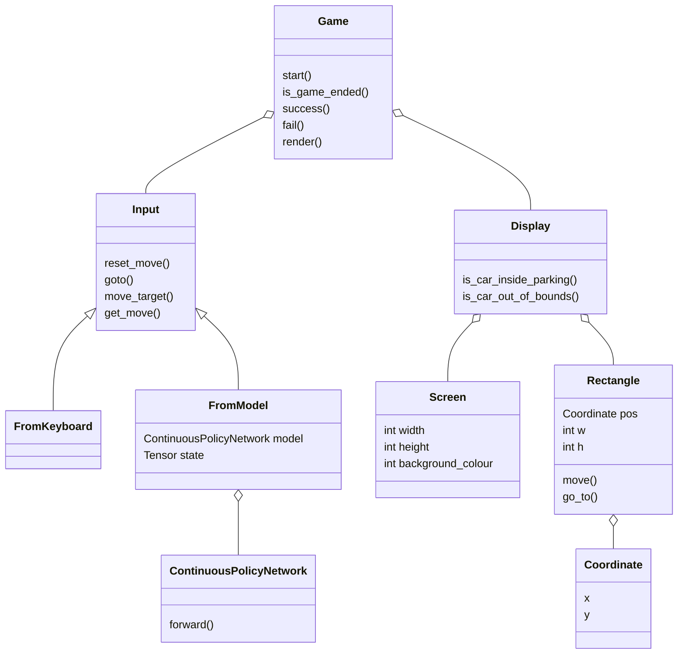

# Move Square Game

## Description

The goal is to move the blue square into the red square without touching the borders of the screen.

The initial positions are random and there are no obstacles.

## Quick Start

### Initialize virtual environment

#### Create a virtual environment 
python -m venv myenv

#### Activate the virtual environment

- Windows
```
myenv\Scripts\activate
```

- macOS and Linux
```
source myenv/bin/activate
```

#### Install requirements
```
pip install -r requirements.txt
```

### Collect demonstrations

- Run `play.py` and play the game. Make sure to succeed and collect good samples.
- Press `<CTRL+C>` on the terminal window when done. 
- The demonstrations will be stored inside the data directory. The file name will be `demonstrations_<date>_<time>.csv`.

### Train your model

- To train the model, execute `train.py <filename>`, where `filename` is the demonstrations file name without the extension (remove .csv).
- After the model is trained, it will be saved as `demonstrations_<date>_<time>.pth`. 
- You can change the hyperparameters or adjust the training parameters in:
    - `util/model.py`
    - `train.py`
- You can retrain as many times as you want, but please keep in mind that it will rewrite the old model. If you want to save as a different name you will have to rename the CSV file.

### Execute the game 

- To execute the game using the trained model, run `execute.py <filename>`, where `filename` is the demonstrations file name without the extension (remove .csv).

That's it. Now you can iterate over this cycle (play, train, execute) adjusting the model and parameters to try to improve the model and obtain a higher success rate.

## Game Class Diagram
> _Install Markdown Preview to see the diagrams in VS Code_


