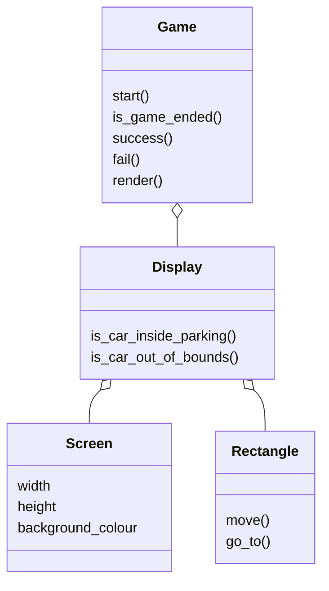

# Games

## Move Square Static

### Description

The goal is to move the blue square into the red square without touching the borders of the screen.

The initial positions are fixed and there are no obstacles.

### Class Diagram
> _Install Markdown Preview to see the diagrams in VS Code_

