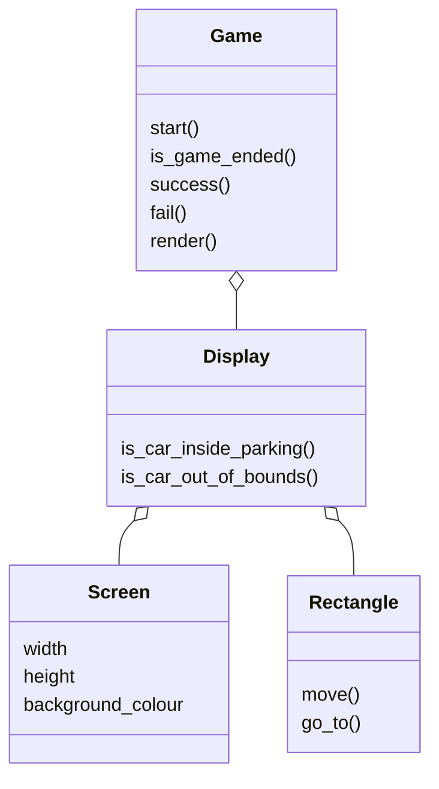

# Games

## Move Square Static

### Description

The goal is to move the blue square into the red square without touching the borders of the screen.

The initial positions are fixed and there are no obstacles.

### Modes of execution

#### From keyboard

```
python3 move_square_static.py
```

This command will instantiate a game object and read the input from the keyboard (arrow keys).
Keep playing, and the output will be printed on the screen.

To run a game reading the input from a file, simply instantiate the object without any arguments (it will default to the keyboard):

```
    game = Game()
```

TODO

- [ ] Save each execution into a replay file

#### From file

This command will instantiate a game object and read the input from a file. You will also have to import inputs.FromFile class.  Currently, the file name is replay_game_1.

```
    from util.inputs import FromFile
    game = Game(input=FromFile('replay_game_1.txt'))
```

## TODO

- [ ] Read file name from command arguments
- [ ] Use RGB images for training
- [ ] Use position control
- [ ] Predict next x moves

## Class Diagram
> _Install Markdown Preview to see the diagrams in VS Code_


